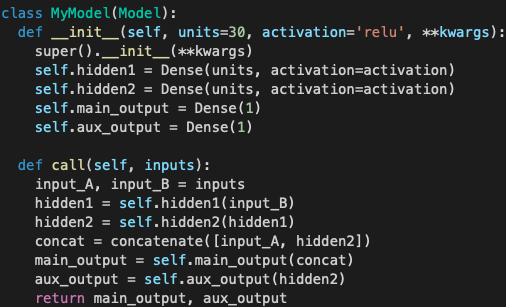
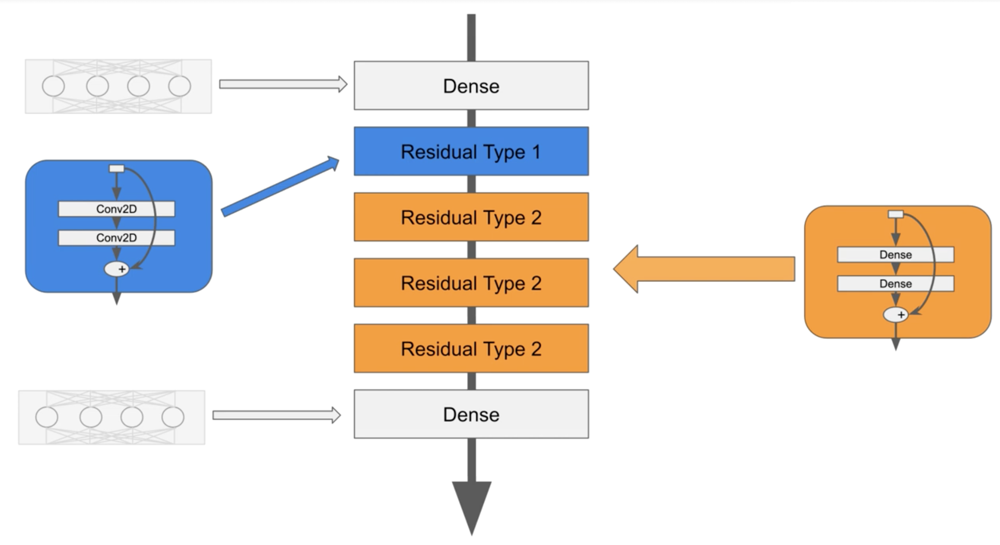

# Custom Models

1. Following is an example of a deep and wide network structure.
   .png>)

- False
- **_True(Answer)_**

2. Consider the following code and check all that are true:
   

- The code is incomplete in the sense that you can only initialize and construct your model, you cannot perform training or inference.
- **_The output layers cannot give more than 1 result each.(Answer)_**
- The concat should be defined within the init function instead of the call function as it is also a hidden layer.
- **_The init function initializes the MyModel Class objects, as well as the attributes that are inherited from the Model Class.(Answer)_**

3. You have learned that Sequential and Functional APIs have their limitations.

How can you build dynamic networks where the architecture changes on the fly, or networks where recursion is used? Check all that are true:

- **_Using model subclassing(Answer)_**
- Using Sequential API
- **_Using Functional API(Answer)_**

4. Which one of the following is a false statement regarding model subclassing?

- **_You cannot introduce a branch structure in the architecture when doing model subclassing.(Answer)_**
- You can make use of Functional and Sequential APIs when writing code for model subclassing.
- Instead of tweaking the entire architecture, you can have different modules and make changes in them as required, as opposed to entirely rewriting the structure.
- You can have modular architectures

5. Consider the following two images:
   

- You loop Residual Type 2 (Dense layers) because you cannot make a loop of Conv2D layers (Residual Type 1)
- **_You make a loop of Residual Type 2 blocks because you want to reduce the depth of the network (making it less complex of an architecture)(Answer)_**
- **_Each Residual block has two hidden layers and one add layer in it.(Answer)_**
- **_When you make a loop of Residual Type 2 blocks, each block could have the same weights.(Answer)_**
