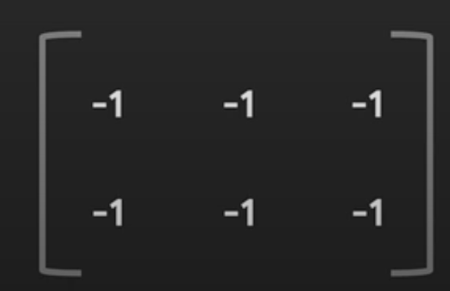

# Tensors and Gradient Tape

1. A Tensor is a flexible data structure that can hold data in a variety of different ways.
   - **_True(Answer)_**
   - False
2. A Tensor can be a vector, matrix or multi-dimensional array but not a scalar
   - **_False(Answer)_**
   - True
3. You want to create a tensor object that is a 2 by 3 matrix containing all -1 values. You also want to be able to modify the values inside the tensor in the future.
Which of the following lines of code should you use? Check all that are true.
<p align="center">

   </p>
    * tf.constant([-1, -1, -1, -1, -1, -1], shape=[2, 3])
    * ***tf.Variable([[-1, -1, -1], [-1, -1, -1]], tf.int32)(Answer)***
    * ***tf.Variable([[-1, -1, -1], [-1, -1, -1]], shape=[2, 3])(Answer)***
    * tf.Variable([-1, -1, -1, -1, -1, -1], tf.int32, shape=[2,3])

4. One type of mode in TensorFlow allows for immediate evaluation of values. What is this mode called?
   - Graph Mode
   - **_Eager Execution(Answer)_**

```python
a = tf.Varable([[5,7],[2,1]])
b = tf.add(a , 2)
c = b ** 2
d = tf.reduce_sum(c)
print(d)
```

5. The output of the code could be: tf.Tensor(x, shape=(), dtype=int32):What is the value of “x” in this case ? Enter in the box below. Enter “0”
   if you think the code above will run into some kind of error. \* **_155(Answer)_**
6. What is the name of the TensorFlow API which handles automatic differentiation?
   - Gradient
   - **_GradientTape(Answer)_**
   - TapeGradient
   - AutoDiff
