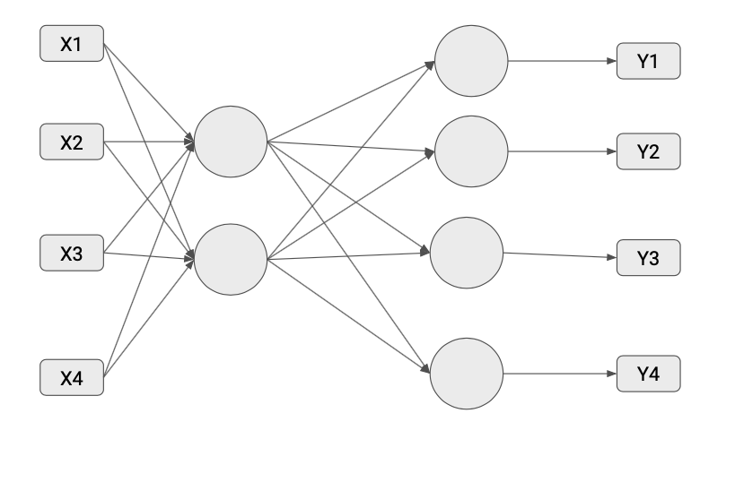
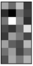

1. Which of the following is a valid architecture for an AutoEncoder? Check all that apply.

   

2. After initializing your AutoEncoder you are all set to train it. Which of the following pieces of code will you use ?

   - autoencoder.fit(X_train, Y_train, epochs=epochs)
   - **_autoencoder.fit(X_train, X_train, epochs=epochs)_**
   - autoencoder.fit(Y_train, X_train, epochs=epochs)
   - autoencoder.fit(Y_train, Y_train, epochs=epochs)

3. Consider the following code for a simple AutoEncoder, what is model_1 outputting ?

   - **_Displaying the internal representation of the input the model is learning to replicate._**
   - Displaying the classification layer of the model, mapping input to the output label.
   - Displaying the reconstruction of the original input which was fed to this architecture.
   - Displaying the label value which the model is trying to reconstruct.

4. Consider the following code for a simple AutoEncoder, which of these is model_1’s output ?

   

5. Consider the following code for adding noise in an image. You use tf.clip_by_valueto constrain the output image to values between 0 & 1.
   - False
   - **_True_**
